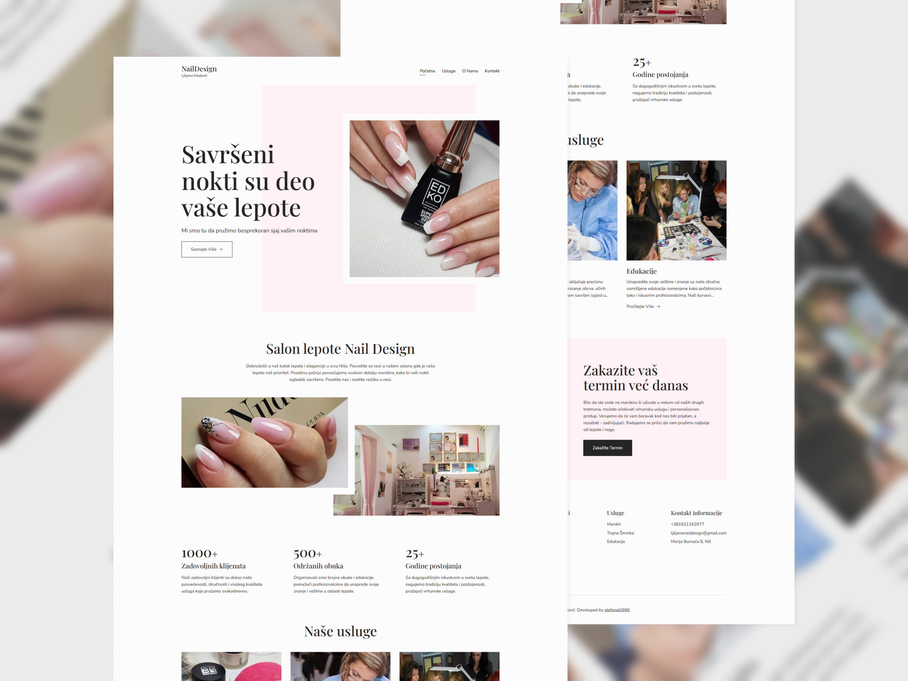

# Nail Design Ljiljana Medović

## Description:

Welcome to the Nail Design Ljiljana Medović website! This site showcases the services and work offered by her beauty salon, providing a glimpse into the expertise and beauty treatments available.

**[Live Preview](https://naildesign-ljiljanamedovic.com/)**

## Features:

- **Clean and Modern Design**: Aesthetic and contemporary design elements to provide a fresh and professional look.
- **Animations**: Smooth and engaging animations to enhance user experience and interaction.
- **Responsive Design**: The website is fully responsive, ensuring an optimal viewing experience on all devices (desktops, tablets, and mobile phones).
- **SEO Optimized**: Implemented best practices for search engine optimization to enhance visibility.

## Technologies Used:

- **Figma**: For designing and prototyping the website's layouts and visual elements, ensuring a clean and modern design.
- **React.js**: For building dynamic and interactive UI with a component-based architecture.
- **Tailwind CSS**: For styling and creating a responsive design.
- **Vite**: For optimizing website's performance.

## Installation

To run this project locally, follow these steps:

1. Clone the repository.
2. Install the required dependencies using `npm install`.
3. Start the development server with `npm run dev`.
4. Open your browser and navigate to `http://localhost:5173` to use the app.
"# glam-parlor" 
